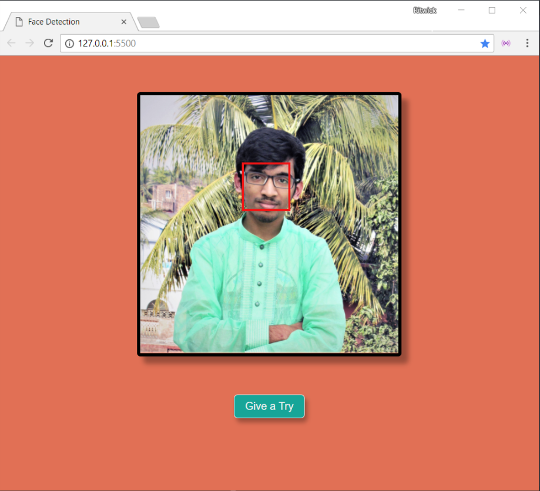

# Face Detector using Chrome API

## Screenshot

---

## Note :

This is an experimental features of Google Chrome. You've to enable the **'Experimental Web Platform Features'** flag from
`chrome://flags/#enable-experimental-web-platform-features` in order to use `Face Detector API`.

---

## Demo:

* https://ritwickdey.github.io/face-detector-chrome-api

---

Thank You.
